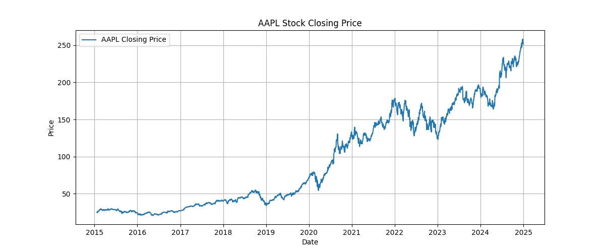

# 📈 Stock Price Trend Prediction using LSTM

## 🎯 Project Objective
Predict future stock closing prices using historical data and an LSTM (Long Short-Term Memory) neural network. This project is part of my internship deliverables and focuses on time-series forecasting using deep learning.

---

## 🧰 Tools & Libraries
- Python
- [yfinance](https://pypi.org/project/yfinance/)
- Pandas, NumPy, Matplotlib
- scikit-learn
- TensorFlow / Keras (LSTM)
- Jupyter Notebook

---

## 📦 Dataset
- Fetched from Yahoo Finance using `yfinance`
- Ticker used: `AAPL`
- Date range: `2015-01-01` to `2024-12-31`
- Data includes: `Open`, `High`, `Low`, `Close`, `Adj Close`, `Volume`

---

## 🚧 Current Progress (Updated)
### ✅ Completed (Day 1–4)
- [x] Downloaded & cleaned historical stock data
- [x] Visualized the closing price trend
- [x] Normalized data using MinMaxScaler
- [x] Created input sequences (60-day sliding window)
- [x] Built initial LSTM model with 2 layers
- [x] Generated input shape: `(2455, 60, 1)`
- [x] Saved price trend plot as `price_plot.png`
---

## 📊 Screenshots

### Closing Price of AAPL (2015–2024)


---

## 🛠️ How to Run

1. Install requirements:
```bash
pip install yfinance pandas numpy matplotlib scikit-learn tensorflow
