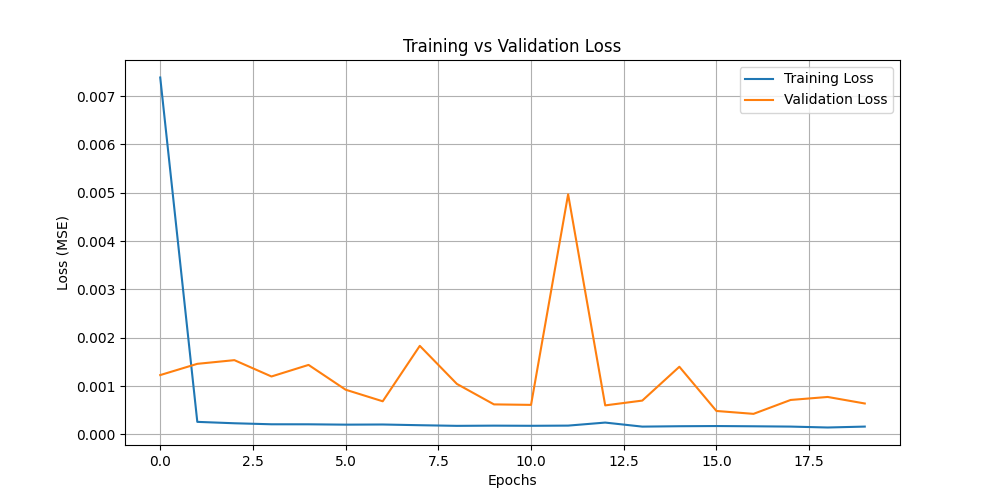
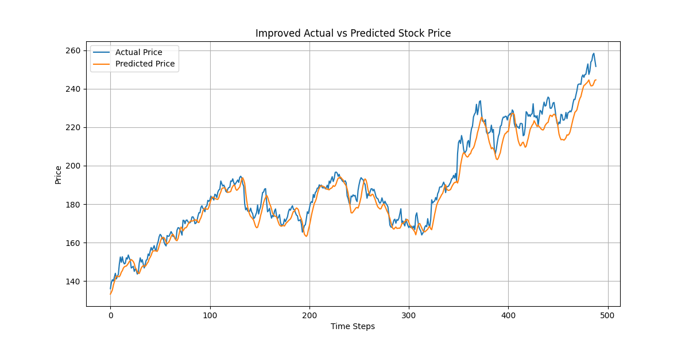

# 📈 Stock Price Trend Prediction using LSTM

This project aims to predict future stock prices based on historical closing price trends using Long Short-Term Memory (LSTM) neural networks. It includes technical indicators such as the 14-day Moving Average and RSI for improved accuracy.

---

## 🚀 Project Overview

- **Objective**: Predict next-day stock prices using past 60-day windows
- **Model**: LSTM Neural Network (2 layers)
- **Dataset**: Stock price data from Yahoo Finance via `yfinance` API
- **Indicators**: MA14 (Moving Average), RSI (Relative Strength Index)
- **Evaluation Metrics**: RMSE, MAE, R² Score
- **Optional UI**: Streamlit dashboard to visualize results

---

## 🧠 Tools & Libraries Used

- Python
- yfinance
- pandas, numpy
- matplotlib, seaborn
- scikit-learn
- keras (TensorFlow backend)
- Streamlit (for dashboard)

---

## 📊 Workflow

1. **Fetch data** from Yahoo Finance using `yfinance`
2. **Compute technical indicators** (MA14 and RSI)
3. **Normalize** the dataset using `MinMaxScaler`
4. **Generate sequences** using sliding 60-day windows
5. **Train-test split**
6. **Build and train LSTM model** with two stacked layers
7. **Evaluate** performance (RMSE, MAE, R²)
8. **Visualize** actual vs predicted prices
9. *(Optional)* Build a **Streamlit app** for interactive prediction and visualization

---

## 📷 Screenshots

### Price Trend


### Loss Curve


### Actual vs Predicted


---

## 🧪 Sample Results

| Metric | Value |
|--------|-------|
| RMSE   | ~2.14 |
| MAE    | ~1.58 |
| R²     | ~0.92 |

> *(Values may vary slightly based on training run and ticker used.)*

---

## ▶️ Run the App (Streamlit)

```bash
streamlit run streamlit_app.py